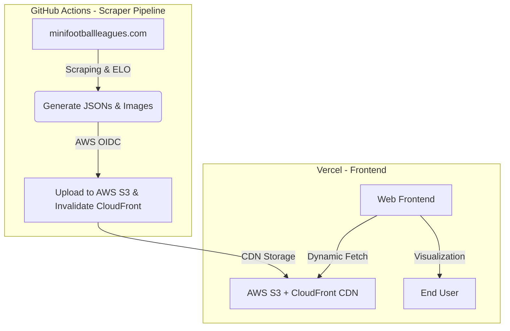

🇪🇸 [Español](README.md) | 🇬🇧 [English](README_EN.md)
---

# What is MiniFootballLeagueAnalyzer?

MiniFootballLeagueAnalyzer is an advanced data analytics tool designed for the MiniFootballLeague in Spain (https://minifootballleagues.com/). 


It extracts competition data using web scraping and provides useful infographics, allowing teams to scout their opponents and understand their own strengths and weaknesses.

These infographics are updated on a weekly basis (every Wednesday at 02:00 UTC).

The website features a dropdown menu to select the desired competition. Each competition includes:

1. **Power Ranking**: Teams are ranked by their current form, rather than official points. This Power Ranking is based on an ELO system similar to the one used by FIFA.
   - **Real Comparison**: The table includes a visual comparison with the official standings.
   - 🟢: The team performs better in ELO than in the official league (Underrated).
   - 🔴: The team performs worse in ELO than in the official league (Overrated).
   - 🟰: ELO and official standings match.


2. **Odds Table**: Displays the odds for the upcoming matchday.

The following 7-a-side (F7) competitions are included:
- Primera División Murcia (1st Division)
- Segunda División A Murcia (2nd Division A)
- Segunda División B Murcia (2nd Division B)
- Tercera División A Murcia (3rd Division A)
- Tercera División B Murcia (3rd Division B)
- Cuarta División Murcia (4th Division)
- Primera División Granada (1st Division)
- Segunda División Granada (2nd Division)
- Liga Veteranos (+35) Granada (Veterans League)

3. **Tournament Venues Map**: An interactive map (via Mapbox) featuring all the match locations across Murcia and Granada, including exact addresses and direct navigation links.


The platform also includes a dropdown menu to select two teams within each competition for a Head-to-Head (H2H) analysis, providing:

- **Odds Table**: Most probable outcomes, percentages, and Expected Goals (xG).


- **ELO Evolution**: A chart tracking the ELO progression of both teams since the beginning of the league.


- **Radar Chart** featuring:
  - **Offensive Power**: Brute scoring capability.
  - **Defensive Solidity**: Ability to prevent goals.
  - **Fair Play**: Discipline level (higher score for fewer cards).
  - **Goal Distribution**: If this value is high (closer to 100%), the team doesn't rely solely on one player to score.
  - **Goal Difference**: Overall competitiveness balance.

## Installation and Configuration

Follow these steps to run the project on your local machine.

### 1. Prerequisites
- **Python 3.10+**
- **Node.js 22.12.0+** (required by Astro 6)
- **Google Chrome** (required for Selenium scraping)

### 2. Environment Configuration (.env)
This project requires several API keys and configurations to function correctly (Chatbot, Maps, Supabase, CDN).
1. Copy the example file:
   ```bash
   cp .env.example .env.local
   ```
2. Edit `.env.local` and add your own keys (Gemini, Mapbox, Supabase).
3. Configure `PUBLIC_CLOUDFRONT_URL=""` (empty) to work offline using local data, or set your CloudFront CDN URL to consume from AWS in development.

### 3. Backend (Python)
From the project root:
```bash
# Create and activate virtual environment
python -m venv .venv
source .venv/Scripts/activate  # On Windows: .venv\Scripts\activate

# Install dependencies
pip install -r requirements.txt
```

### 4. Frontend (Astro)
From the `frontend/` folder:
```bash
cd frontend
npm install
npm run dev
```

### 5. Quality Assurance (Testing)

The project uses **pytest** to ensure the integrity of the ELO system logic and data processing.

1. Run the complete suite of unit and integration tests:
   ```bash
   pytest
   ```
   *(Note: Tests are located in the `tests/` directory and include validations for the ELO algorithm and JSON structure).*

2. To run **frontend** unit and integration tests (React components):
   ```bash
   cd frontend
   npm test
   ```
   *(Note: Uses **Vitest** and **React Testing Library** to validate the Chatbot, H2H calculation, Poisson matrix, and table interfaces without needing to open a browser).*

3. To run **End-to-End (E2E)** tests with **Playwright** (including payment redirection scenarios using Stripe Sandbox):
   ```bash
   cd frontend
   npx playwright install --with-deps # Installs required browser binaries the first time
   npx playwright test                # Runs all E2E tests in headless mode (Chromium)
   npx playwright test --ui           # Opens the interactive visual UI for Playwright
   ```
   *(Note: The E2E tests automatically spin up the local development server and safely intercept/mock Supabase authentication and Stripe Sandbox checkout processes).*

---

## Project Workflow



### Backend & Cloud Storage (AWS S3 + CloudFront)

#### Collection and Processing
Python along with Selenium and BeautifulSoup is used to scrape data from the official website. The collected data is stored as JSON files inside the `/jsons` directory. After scraping, `sync_logos.py` localizes and downloads the images, and `simulacion_final.py` calculates ELO Power Rankings and statistics.

#### Storage and CDN
To avoid repository bloating and improve load times:
1. All ELO rankings, goalscoring stats, and graphics (crests and player pictures) are automatically uploaded to the **AWS S3** bucket.
2. Data and images are served to production users via the **AWS CloudFront** global CDN network.
3. The React and Astro frontend performs direct, asynchronous `fetch` requests to CloudFront at runtime, fallbacking automatically to local assets when working offline in development.

### Automation
The complete scraping, ELO calculation, and AWS synchronization pipeline runs weekly (every Wednesday at 02:00 UTC) via **GitHub Actions**, authenticating with AWS using OpenID Connect (OIDC) without storing long-lived credentials in the repository.


### AI Chatbot
An AI chatbot powered by the Gemini family models to query information about teams and competitions. It can be accessed via a button in the bottom right corner of the website.


### Integrated E-commerce
The project includes a payment gateway implemented with **Stripe**. This integration securely manages the platform's e-commerce and allows simulating payment scenarios using *Stripe Sandbox* during testing.
