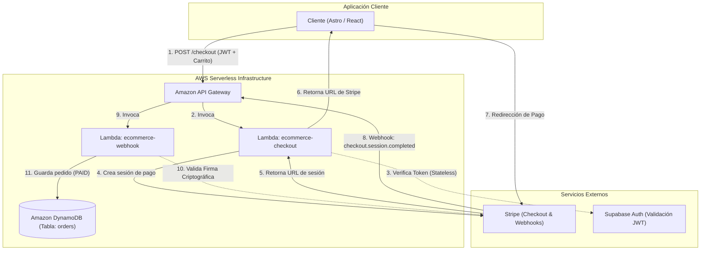

# AWS E-Commerce Serverless Services Guide

Este directorio contiene las funciones serverless de AWS Lambda expuestas públicamente a través de Amazon API Gateway y persistidas en Amazon DynamoDB para procesar los pagos de merchandising.

## Diagrama de Flujo Arquitectónico

El siguiente diagrama ilustra cómo interactúa nuestro frontend, los componentes de AWS (API Gateway, Lambda, DynamoDB) y los servicios de Stripe y Supabase durante el proceso de compra y confirmación de pedidos:



---

## 1. Configuración de Base de Datos (DynamoDB)

Puedes crear la tabla `orders` y su Índice Secundario Global (GSI) `UserOrdersIndex` mediante la consola de AWS o ejecutando la siguiente instrucción de AWS CLI:

```bash
aws dynamodb create-table \
    --table-name orders \
    --attribute-definitions \
        AttributeName=order_id,AttributeType=S \
        AttributeName=user_id,AttributeType=S \
        AttributeName=created_at,AttributeType=N \
    --key-schema \
        AttributeName=order_id,KeyType=HASH \
    --global-secondary-indexes \
        "[{\"IndexName\": \"UserOrdersIndex\", \"KeySchema\": [{\"AttributeName\": \"user_id\", \"KeyType\": \"HASH\"}, {\"AttributeName\": \"created_at\", \"KeyType\": \"RANGE\"}], \"Projection\": {\"ProjectionType\": \"ALL\"}, \"ProvisionedThroughput\": {\"ReadCapacityUnits\": 5, \"WriteCapacityUnits\": 5}}]" \
    --provisioned-throughput ReadCapacityUnits=5,WriteCapacityUnits=5
```

---

## 2. Configuración de Seguridad (IAM Execution Role)

Crea un rol de IAM en AWS para tus funciones Lambda (ej. `ecommerce-lambda-execution-role`) y adjunta las siguientes dos políticas:

1. **`AWSLambdaBasicExecutionRole`** (política nativa de AWS para habilitar logs en CloudWatch).
2. **`orders-db-access-policy`** (crea una política personalizada con el siguiente JSON para habilitar acceso de lectura/escritura a la tabla y su índice):

```json
{
  "Version": "2012-10-17",
  "Statement": [
    {
      "Effect": "Allow",
      "Action": [
        "dynamodb:PutItem",
        "dynamodb:GetItem",
        "dynamodb:UpdateItem",
        "dynamodb:Query"
      ],
      "Resource": [
        "arn:aws:dynamodb:*:*:table/orders",
        "arn:aws:dynamodb:*:*:table/orders/index/UserOrdersIndex"
      ]
    }
  ]
}
```

---

## 3. Instalación Local y Empaquetado

### Paso 1: Instalar Dependencias de Producción
Antes de empaquetar, instala únicamente los paquetes necesarios para producción (evita subir dependencias dev):
```bash
# Entra en la carpeta de lambdas
cd backend/lambda
# Instala las dependencias
npm install --omit=dev
```

### Paso 2: Generar y Subir el ZIP de cada Lambda

#### Lambda de Checkout (`ecommerce-checkout`):
```powershell
# En Windows PowerShell
cd backend/lambda/checkout
Compress-Archive -Path index.js, ../node_modules -DestinationPath checkout.zip
```
Sube `checkout.zip` en la consola de AWS Lambda o ejecútalo mediante AWS CLI:
```bash
aws lambda update-function-code --function-name ecommerce-checkout --zip-file fileb://checkout.zip
```

#### Lambda de Webhook (`ecommerce-webhook`):
```powershell
# En Windows PowerShell
cd backend/lambda/webhook
Compress-Archive -Path index.js, ../node_modules -DestinationPath webhook.zip
```
Sube `webhook.zip` en la consola de AWS Lambda o ejecútalo mediante AWS CLI:
```bash
aws lambda update-function-code --function-name ecommerce-webhook --zip-file fileb://webhook.zip
```

---

## 4. Configuración de API Gateway (HTTP API) y CORS

Para exponer públicamente tus funciones Lambda a través de endpoints HTTP:

### Paso 1: Crear una API HTTP
1. Ve a la consola de **Amazon API Gateway** y haz clic en **Build** bajo **HTTP API**.
2. Ponle un nombre descriptivo (ej. `ecommerce-api`).

### Paso 2: Configurar las Rutas e Integraciones
1. En el menú de la izquierda, selecciona **Routes** y crea las siguientes rutas:
   - **`POST /checkout`**
   - **`POST /webhook`**
2. Selecciona la ruta `POST /checkout`, haz clic en **Attach integration**, elige **Lambda function** y selecciona la función `ecommerce-checkout`.
3. Selecciona la ruta `POST /webhook`, haz clic en **Attach integration**, elige **Lambda function** y selecciona la función `ecommerce-webhook`.

### Paso 3: Configurar CORS (Cross-Origin Resource Sharing)
Para permitir que la aplicación Astro/React (que corre en un dominio diferente como Vercel o localhost) pueda llamar al endpoint de checkout:
1. En el menú de la izquierda, selecciona **CORS** bajo **API: ecommerce-api**.
2. Haz clic en **Configure** y añade los siguientes valores:
   - **Access-Control-Allow-Origin**: `*` (o la URL específica de tu frontend en producción para mayor seguridad).
   - **Access-Control-Allow-Headers**: `content-type, authorization`.
   - **Access-Control-Allow-Methods**: `POST, OPTIONS`.
3. Haz clic en **Save**.

### Paso 4: Desplegar la API
1. Por defecto, las APIs HTTP tienen habilitado el despliegue automático en la etapa `$default`.
2. Copia la URL de invocación de la API (ej: `https://a1b2c3d4e5.execute-api.eu-west-1.amazonaws.com`).
3. El endpoint de checkout final será: `https://a1b2c3d4e5.execute-api.eu-west-1.amazonaws.com/checkout`
4. El endpoint de webhook para Stripe será: `https://a1b2c3d4e5.execute-api.eu-west-1.amazonaws.com/webhook`

